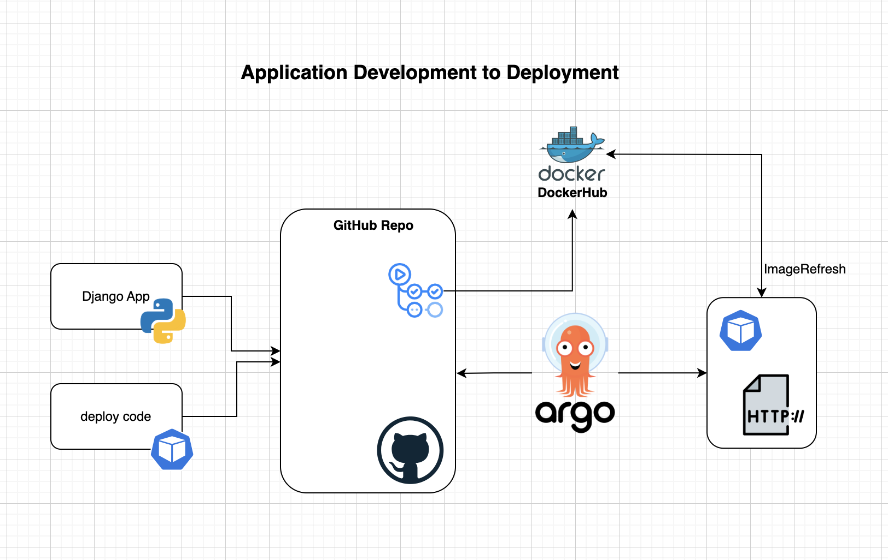

## Here is YouTube Videos Playlist
https://youtube.com/playlist?list=PLjgaiFji7j4Rlcb4iiO3VMebRAnK_dYeY&si=cJ9cD2b-tpFwEsd-


# App-Development-To-Deployment



---

## Overview

This project demonstrates the complete workflow of developing, testing, containerizing, and deploying a sample application using modern DevOps tools and practices. It is designed to help you get hands-on experience with application development, containerization, CI/CD automation, and Kubernetes deployment.

### Project Goals

- **Develop** a sample application and understand the basics of app development.
- **Test** the application locally using Docker or Podman containers.
- **Automate** image building and pushing to a registry using GitHub Actions.
- **Deploy** the containerized application to Kubernetes using ArgoCD.

---

## 1. Lab Setup Using This Repo

### Clone the Repository

```bash
git clone https://github.com/<your-username>/App-Development-To-Deployment.git
cd App-Development-To-Deployment
```

### Prerequisites

- Python 3
- pip
- Podman

### Configure Python Virtual Environment

Create a virtual environment:

```bash
python3 -m venv venv
```

Activate the virtual environment:

```bash
source venv/bin/activate
```

---

## 2. Django Project Setup

Install Django:

```bash
pip install django
```

Start a new Django project:

```bash
django-admin startproject sampleapp .
```

Create a new Django app:

```bash
python3 manage.py startapp helloworldsite
```

Run the development server:

```bash
python3 manage.py runserver
```

Access the app at:  
[http://127.0.0.1:8000/](http://127.0.0.1:8000/)

---

## 3. Containerize with Podman

Build the container image:

```bash
podman build -t sampleapp .
```

Run the container:

```bash
podman run -d -p 8000:8000 sampleapp
```

Access the app in your browser:  
[http://localhost:8000/](http://localhost:8000/)

---

## 4. CI/CD and Deployment

### Automate Container Image Build and Push with GitHub Actions

1. **Configure GitHub Actions Workflow**
   - Ensure your repository contains a workflow file in the `.github/workflows` directory.  
   - This workflow should automate building your container image and pushing it to your container registry (e.g., Docker Hub or GitHub Container Registry).
   - For a real example, review the workflow YAML files in `.github/workflows` within your repository.

2. **Review GitHub Actions Execution**
   - After pushing changes to your repository, GitHub Actions will automatically trigger the workflow.
   - To review the execution:
     - Go to your repository on GitHub.
     - Click on the **Actions** tab at the top.
     - Select the latest workflow run to view logs, steps, and results.
     - Check for any errors or warnings and ensure the image was successfully built and pushed.
   - You can click into each step of the workflow to see detailed logs and troubleshoot any issues.

---

### Deploy to Kubernetes with ArgoCD

1. **Install ArgoCD**
   - Follow the official documentation: [ArgoCD Getting Started](https://argo-cd.readthedocs.io/en/stable/getting_started/)
   - Quick install steps:
     ```bash
     kubectl create namespace argocd
     kubectl apply -n argocd -f https://raw.githubusercontent.com/argoproj/argo-cd/stable/manifests/install.yaml
     ```

2. **Access ArgoCD Web UI**
   - For lab environments, use port-forwarding:
     ```bash
     kubectl port-forward svc/argocd-server -n argocd 8080:443
     ```
   - Access the UI at: [https://127.0.0.1:8080/](https://127.0.0.1:8080/)

3. **Login to ArgoCD**
   - Retrieve the initial admin password:
     ```bash
     kubectl get secret argocd-initial-admin-secret -n argocd -o jsonpath="{.data.password}" | base64 --decode
     ```
   - Login with username `admin` and the decoded password.

4. **Update ArgoCD Documentation**
   - To update your deployment configuration, edit your ArgoCD application manifest (YAML file) to reference the new container image tag pushed by GitHub Actions.
   - Example snippet:
     ```yaml
     spec:
       source:
         repoURL: 'https://github.com/<your-username>/App-Development-To-Deployment.git'
         path: k8s
         targetRevision: HEAD
       destination:
         server: 'https://kubernetes.default.svc'
         namespace: sampleapp
     ```
   - Commit and push changes to your repository. ArgoCD will detect updates and synchronize your application automatically.

5. **Monitor Deployment**
   - In the ArgoCD Web UI, check the status of your application.
   - Ensure the new image is deployed and the app is running as expected.

---

The last final steps access the application deployed on. K8s using portforwarding
   - For lab environments, use port-forwarding:
     ```bash
      kubectl port-forward svc/django-service 8081:80 -n django-app
     ```

---

## ⭐️ Support & Feedback

If you found this project helpful, please consider giving it a ⭐️ on GitHub!  
Your support motivates us to create more practical DevOps tutorials and open-source projects.

- **Questions or Suggestions?**  
  Open an [issue](https://github.com/santhoshkpoturaju/App-Development-To-Deployment/issues) or start a [discussion](https://github.com/santhoshkpoturaju/App-Development-To-Deployment/discussions).
- **Contributions Welcome!**  
  Feel free to submit pull requests to improve the project or documentation.

---

## 📚 More Learning

- Check out the [official documentation](https://argo-cd.readthedocs.io/en/stable/) for ArgoCD.
- Stay tuned for **Series Part 2**, where we’ll cover advanced deployment automation using Kustomize and dynamic image tagging.

---

Thank you for reading and happy coding! 🚀

Scope to explore further: There are many things to do like use this as framework, repeat same process for ngnix deployment, MongoDB deployment or any application deployments. 


## Questions:
# Which of the following is the correct way to generate a Docker image tag using the release name or version in a GitHub Actions workflow? #

A) tags: ${{ secrets.DOCKERHUB_USERNAME }}/helloworlddjango:${{ github.event.release.tag_name }}
B) tags: ${{ secrets.DOCKERHUB_USERNAME }}/helloworlddjango:${{ github.ref }}
c) tags: ${{ secrets.DOCKERHUB_USERNAME }}/helloworlddjango:${{ GITHUB_REF_NAME }}
D) tags: ${{ secrets.DOCKERHUB_USERNAME }}/shelloworlddjango:release